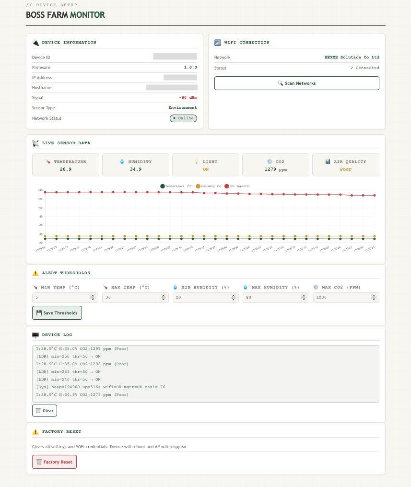
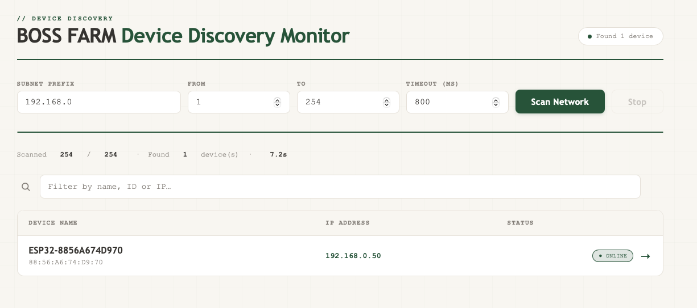
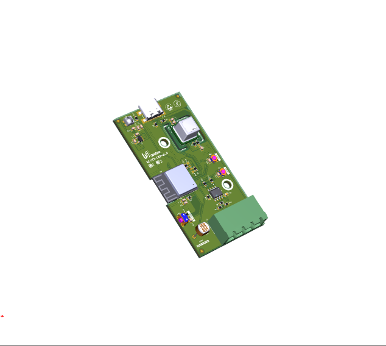
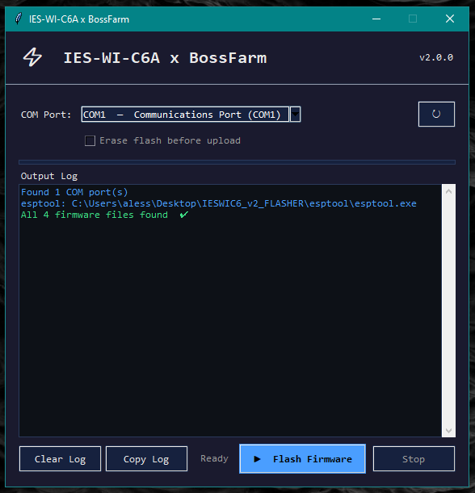

# IES-WI-C6A x BossFarm Smart Monitor — Firmware Implementation


---
ESP32-C6 firmware for environmental monitoring with local MQTT publishing, persistent NVS storage, and dynamic sensor type configuration.

---

## Board Migration Notes (C3 → C6)

This firmware targets the **ESP32-C6** (IES-WI-C6A). Key differences from the previous C3 build:

- **Platform:** `pioarduino` fork required — `espressif32@6.9.0` has no C6 support. Uses `arduino-esp32 3.x` (IDF 5.x).
- **Board string:** `esp32-c6-devkitc-1`
- **I2C pins swapped:** SDA=GPIO6, SCL=GPIO7 (C3 had them reversed)
- **ADC attenuation:** `ADC_11db` removed in arduino-esp32 3.x; default 12dB attenuation used instead via `pinMode(INPUT)`
- **Upload:** `board_upload.use_1200bps_touch` removed (SAMD-only trick, causes C6 upload hangs)

---

## Architecture Overview

### Module Structure

```
sensors.h ← Single source of truth for all sensor state
├── scd40.cpp/h                 (SCD40 CO2 driver, raw I2C)
├── ldr.cpp/h                   (LDR light detection)
└── extern declarations         (sensorTemp, sensorHum, sensorCO2, ldrLightOn, alert flags)

main.cpp                        (setup/loop, sensor reads, LED, MQTT publish, WiFi fallback)
├── scd40Read()                 (5s interval via polling)
├── ldrRead()                   (5s interval via polling)
├── NeoPixel ring               (20ms update, status colour)
└── MQTT publish                (5s telemetry, 60s attributes)

local_mqtt.cpp/h                (MQTT connection to Raspberry Pi broker)
├── localMqttPublish()          (telemetry: temp, hum, CO2, light)
├── localMqttPublishConfig()    (attributes: thresholds, firmware, MAC)
├── Sensor type dispatch        (ENV/SOIL/MIN topic routing)
└── NVS broker storage

web_server.cpp/h                (HTTP server, captive portal, single-page UI)
├── handleRoot()                (HTML UI)
├── handleSensors()             (live JSON)
├── handleSetWifi()             (WiFi provisioning)
├── handleSetThresh()           (threshold persistence)
├── handleSetSensorType()       (type 1/2/3 selection)
└── Log buffer                  (circular 40-line buffer)

wifi_config.cpp/h               (WiFi credential storage & connection)
├── wifiConfigSave()            (NVS netcfg namespace)
├── wifiConfigConnect()         (STA connection with timeout)
└── wifiApStart()               (AP mode for configuration)

factory_reset.cpp/h             (GPIO4 button, 5s hold detection)
└── factoryResetExecute()       (clears all NVS namespaces)

```

### Global State (sensors.h)

All sensor state is declared as `extern` in `sensors.h` and defined in their respective driver files:

```cpp
// From scd40.cpp
extern float    sensorTemp;    // Temperature (°C)
extern float    sensorHum;     // Humidity (%)
extern uint16_t sensorCO2;     // CO2 (ppm)
extern bool     sensorOK;      // Sensor initialized
extern bool     alertTemp;     // Temp threshold exceeded
extern bool     alertHum;      // Humidity threshold exceeded
extern bool     alertCO2;      // CO2 threshold exceeded

// From ldr.cpp
extern bool ldrLightOn;        // Light detected
extern bool ldrOK;             // Sensor initialized
```

This ensures **no module directly includes sensor drivers** — everything goes through `sensors.h`.

---

## Sensor Drivers

### SCD40 (scd40.cpp)

**Raw I2C implementation** — no external library. Implements Sensirion protocol with CRC-8 validation.

**Timing:**
- I2C clock: 100 kHz
- Periodic measurement: 5-second interval
- First valid reading: ~5.2 seconds after boot
- Poll interval: 1 second (checks data-ready flag)
- Minimum read interval: 5.2 seconds (enforced)

**CRC-8 Validation:**
- Polynomial: `0x31`
- Every 16-bit word has an 8-bit CRC byte
- All reads and writes validated before accepting

**Command Set:**
```cpp
0x21B1  START_PERIODIC_MEASUREMENT
0xEC05  READ_MEASUREMENT           (3 words: CO2, temp, humidity)
0x3F86  STOP_PERIODIC_MEASUREMENT
0xE4B8  GET_DATA_READY_STATUS
0x3682  GET_SERIAL_NUMBER
0x202F  GET_SENSOR_VARIANT
```

**Data Conversion:**
```cpp
CO2_ppm = word0
Temperature_C = -45 + 175 * word1 / 65535
Humidity_% = 100 * word2 / 65535
```

**Sanity Checks:**
- Temperature: -40°C to 120°C
- Humidity: 0% to 100%
- CO2: 0 to 40,000 ppm (rejects if >40k)
- Any CRC failure: frame discarded, retry on next poll

**Debug Output:**
```
[SCD40] DataReady raw=0x0800 ready=YES
[SCD40 RAW] 02 84 4F  5C 4A AB  85 54 69   (3 words + 3 CRCs)
[SCD40] CRC CO2=OK TEMP=OK HUM=OK
[SCD40] Decoded rawCO2=644 rawT=23626 rawH=34132 -> CO2=644 T=22.78 H=53.29
[SCD40] T:22.8°C H:53.3% CO2:644 ppm (Good)
```

### LDR (ldr.cpp)

**Voltage divider ADC input** on GPIO0.

**Timing:**
- Reads every 5 seconds (synced with sensor interval)
- 5 samples taken with 5ms delay between reads
- Minimum valid reading requires 3+ valid ADC values (filters spikes)

**Logic:**
- ADC value > threshold → light ON
- ADC value ≤ threshold → light OFF
- Threshold adjustable in `config.h` (default: 50)

**Note (C6 / arduino-esp32 3.x):** `analogSetPinAttenuation()` with `ADC_11db` is removed. Default 12dB attenuation is applied automatically. `ldrInit()` uses `pinMode(INPUT)` only — no IDF GPIO calls.

---

## Main Loop Flow (main.cpp)

### setup()

1. Serial init (115200 baud)
2. NeoPixel init + clear
3. Factory reset button init
4. SCD40 init (I2C, periodic measurement start)
5. LDR init (ADC setup)
6. WiFi init:
   - Mode: WIFI_AP_STA
   - AP always enabled (unique SSID from MAC)
   - Load saved WiFi credentials
   - If commissioned: attempt STA connection (15s timeout)
   - If not commissioned: AP visible, no STA attempt
7. Web server init (HTTP on port 80)
8. Load thresholds from NVS

### loop()

**Execution order (runs every ~1ms):**

1. **Web server handle** (non-blocking)
2. **Local MQTT handle** (non-blocking, 5s reconnect)
3. **Provisioning handle** (optional)
4. **Factory reset check** (GPIO4 hold detection)
5. **Delay 1ms** (prevent watchdog, allow background tasks)

**Every 5 seconds (sensor interval):**
- Clear LED ring
- LDR read
- Show updated LED (status colour)

**Every 20ms (LED update):**
- Commissioned + WiFi + MQTT → Green
- Commissioned + WiFi, no MQTT → Amber
- Commissioned, no WiFi → Red
- Not commissioned → Blue

**Every 5 seconds (MQTT publish):**
- Local MQTT: publish telemetry
- If commissioned: update alertTemp, alertHum, alertCO2

**Every 30 seconds (health log):**
- Log free heap, uptime, WiFi status, MQTT status, RSSI

**WiFi fallback logic:**
- If WiFi disconnected for >30s: re-enable AP
- Retry STA every 120s if commissioned and credentials exist
- If reconnected: disable AP, enable mDNS

---

## Local MQTT (local_mqtt.cpp)

### Publishing

**Telemetry (every 5 seconds):**

Topic: `sensors/{DEVICE_ID}/{MEASUREMENT_TYPE}`

Device IDs by type:
- Type 1: `ENV_{LAST_4_MAC_CHARS}` (e.g., `ENV_61D4`)
- Type 2: `SOIL_{LAST_4_MAC_CHARS}`
- Type 3: `MIN_{LAST_4_MAC_CHARS}`

Measurement types:
- Type 1: `telemetry`
- Type 2: `soil`
- Type 3: `mineral`

Example payload (Type 1):
```json
{
  "device_id": "ENV_61D4",
  "timestamp": "2024-05-25T14:30:45Z",
  "reading": {
    "sensor_type": 1,
    "sensor_type_label": "environment",
    "firmware": "1.0.0",
    "rssi": -65,
    "temperature": 22.50,
    "humidity": 55.00,
    "co2": 650,
    "eco2": 650,
    "co2_label": "Good",
    "co2_valid": true,
    "alert_temp": false,
    "alert_temp_num": 0,
    "alert_hum": false,
    "alert_hum_num": 0,
    "alert_co2": false,
    "alert_co2_num": 0,
    "light_on": true,
    "light_on_num": 1
  }
}
```

**Attributes (every 60 seconds, forced after reconnect):**

Topic: `sensors/{DEVICE_ID}/attributes`

```json
{
  "device_id": "ENV_61D4",
  "timestamp": "2024-05-25T14:30:45Z",
  "reading": {
    "mac": "A4CF12AA61D4",
    "ip": "192.168.0.42",
    "rssi": -65,
    "firmware": "1.0.0",
    "sensor_type": 1,
    "sensor_type_label": "environment",
    "highTempThreshold": 30.00,
    "lowTempThreshold": 5.00,
    "highHumThreshold": 80.00,
    "lowHumThreshold": 20.00,
    "highEco2Threshold": 1000.00
  }
}
```

---

## Configuration (config.h)

```cpp
// Access Point
#define AP_SSID             "ESP32C3_Hotspot"

// Hardware Pins — ESP32-C6
#define NEOPIXEL_PIN        3
#define I2C_SDA             6   // ← swapped vs C3
#define I2C_SCL             7   // ← swapped vs C3
#define LDR_PIN             0
#define FACTORY_RESET_PIN   4

// Timing
#define SENSOR_INTERVAL     5000   // 5 seconds
#define LED_INTERVAL        20     // 20ms

// Temperature Range (for LED hue)
#define TEMP_MIN            15.0f
#define TEMP_MAX            35.0f

// Thresholds
#define LDR_THRESHOLD       50

// Local MQTT (default)
#define LOCAL_MQTT_SERVER   "weedsync.local"
#define LOCAL_MQTT_PORT     1883

// mDNS
#define MDNS_PREFIX         "bossfarm"

// Device
#define FIRMWARE_VERSION    "2.0.0"
#define SENSOR_TYPE_DEFAULT 1  // 1=Environment, 2=Soil, 3=Mineral
```

---

## Sensor Types

### Type 1: Environment
- **Topic:** `sensors/ENV_{MAC}/telemetry`
- **Fields:** temperature, humidity, CO2, light

### Type 2: Soil
- **Topic:** `sensors/SOIL_{MAC}/soil`
- **Fields:** EC (electrical conductivity), RH (relative humidity)

### Type 3: Mineral
- **Topic:** `sensors/MIN_{MAC}/mineral`
- **Fields:** EC, N, P, K (nitrogen, phosphorus, potassium)

**Current implementation:** Types 2 & 3 have placeholder payloads.

---

## Alert Thresholds

**Defaults:**
- `threshTemp`: 30.0°C max, 5.0°C min
- `threshHum`: 80.0% max, 20.0% min
- `threshCO2`: 1000.0 ppm max

Alerts trigger on **strictly greater than** — equal does not trigger. Persisted in NVS, editable via web UI.

---

## NVS Namespaces

| Namespace | Keys | Purpose |
|---|---|---|
| `netcfg` | `ssid`, `pass` | WiFi credentials |
| `thresholds` | `temp`, `temp_low`, `hum`, `hum_low`, `co2` | Alert thresholds |
| `device` | `commissioned`, `sensor_type` | Device state |
| `broker` | `host`, `port` | MQTT broker address |
| `provision` | `token`, `device_name` | Provisioning (disabled) |

---

## Commissioning Model

**First boot:** AP enabled, no WiFi, no MQTT. Connect to AP → open `192.168.4.1` → enter WiFi credentials → device commissions and starts publishing.

**After commissioning:** AP disables, mDNS starts, MQTT connects. AP re-enables if WiFi drops for >30s.

---

## Build & Deployment

```bash
# Build
pio run -e esp32c6

# Flash
pio run -e esp32c6 --target upload

# Monitor
pio device monitor --baud 115200

# Clean build
pio run --target clean && pio run -e esp32c6 --target upload
```

**platformio.ini:**
```ini
[env:esp32c6]
platform = https://github.com/pioarduino/platform-espressif32/releases/download/53.03.13/platform-espressif32.zip
board     = esp32-c6-devkitc-1
framework = arduino

monitor_speed = 115200
upload_speed  = 921600

upload_protocol = esptool
board_upload.wait_for_upload_port = true

build_flags =
    -DCORE_DEBUG_LEVEL=0
    -DARDUINO_USB_MODE=1
    -DARDUINO_USB_CDC_ON_BOOT=1
    -DCONFIG_PM_ENABLE=0

lib_deps =
    adafruit/Adafruit NeoPixel @ ^1.12.3
    adafruit/Adafruit Unified Sensor @ ^1.1.14
    adafruit/Adafruit BusIO @ ^1.16.1
    knolleary/PubSubClient @ ^2.8.0
    bblanchon/ArduinoJson@^6.21.0
```

---

## Testing

**Native unit tests** (no hardware required):
```bash
pio test -e native
```

Covers: sensor validation, threshold logic, WiFi config validation, MQTT payload building, provisioning JSON parsing, AQI label mapping.

---

## Known Limitations & Future Work

- **Soil & Mineral types:** Placeholder payloads only — implement actual sensor drivers
- **Provisioning:** Disabled by default, not actively maintained
- **Buffer sizes:** MQTT payload 1024 bytes, log 40 lines — increase if needed
- **I2C:** Single bus, single device (SCD40 only)
- **Power:** Always-on AP draws ~100mA extra vs STA-only mode

---

## Web AP Screenshots




## PCBA 3D


## Firmware Flash Tool GUI
